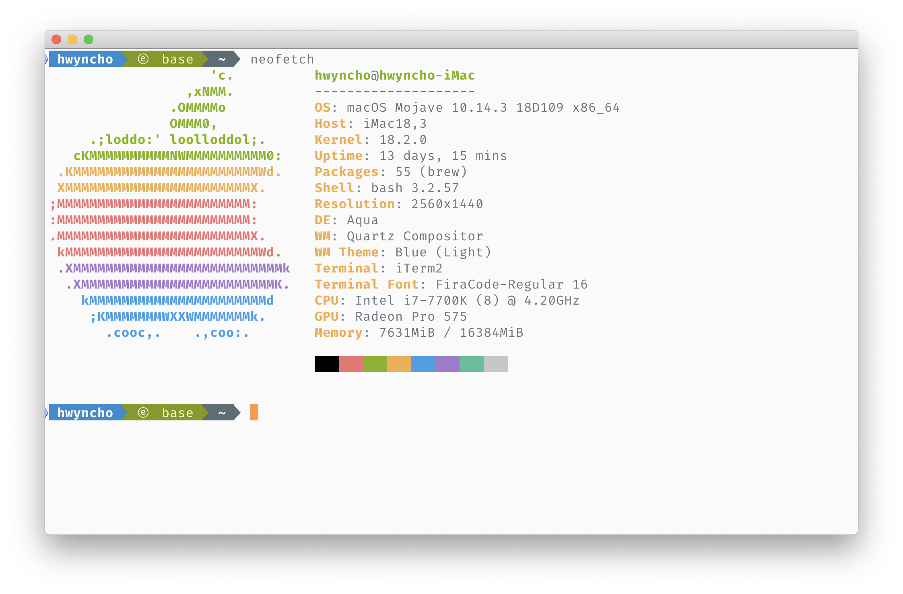
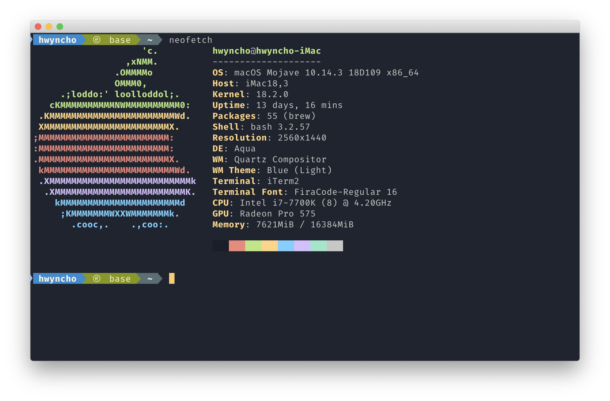

# ayu-iTerm
> [ayu color theme](https://github.com/ayu-theme) for [iTerm2](https://www.iterm2.com/)

## Screenshots
* ayu Light

* ayu Mirage

* ayu Dark

## How to install
1. _iTerm_ > `Preferences` > `Profiles` > `Colors` Tab
2. Open the `Color Presets...` drop-down in the bottom right corner
3. Select `Import...` from the list
4. Select the `itermcolors` file
5. Select the ayu-Light | ayu-Mirage | ayu-Dark from `Color Presets...`
